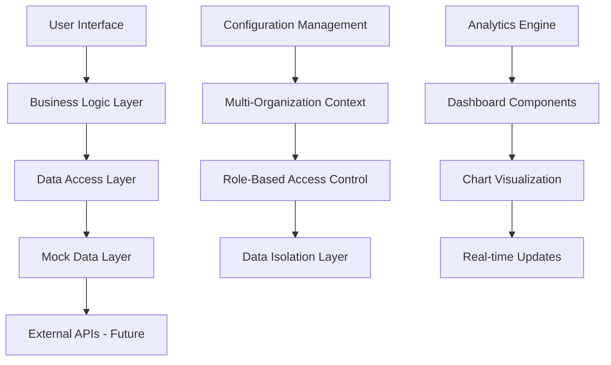
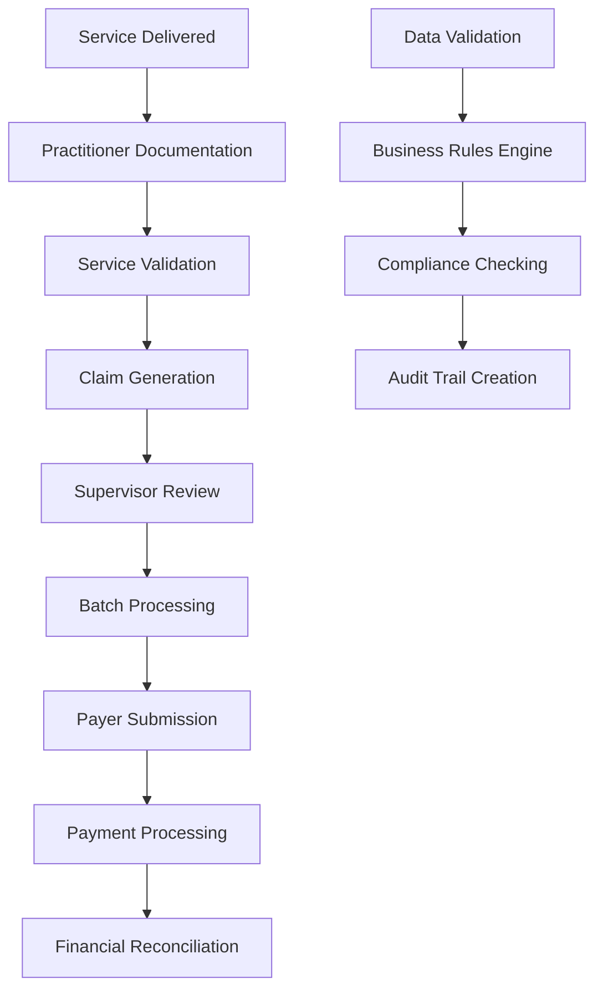
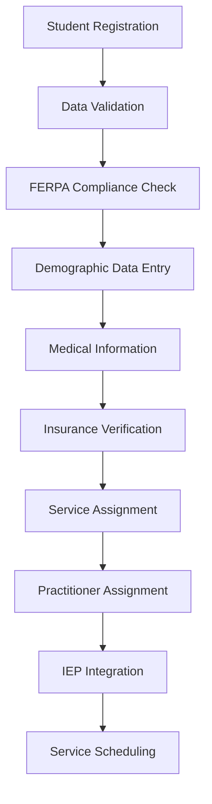
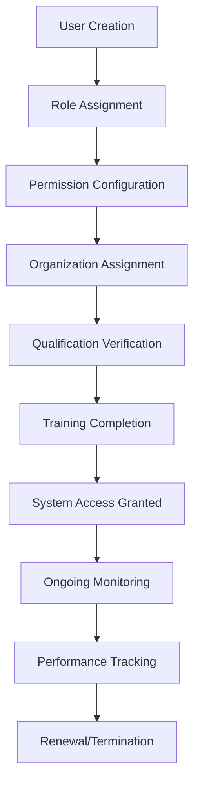
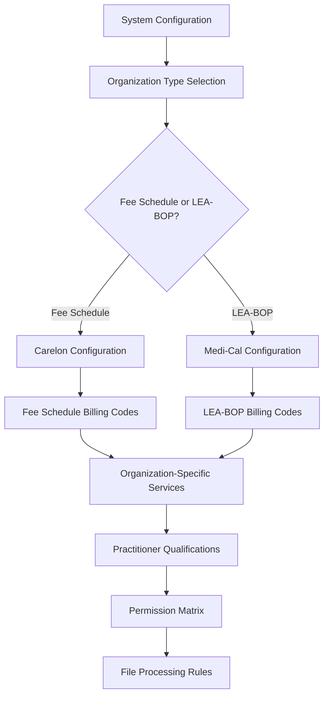

# KIDS Dashboard - Data Architecture Documentation

## 1. Executive Summary

The KIDS (Kids Information Data System) Dashboard employs a modern, scalable data architecture designed to support special education service management, claims processing, and comprehensive reporting. Built on Next.js 14 with TypeScript, the system ensures type safety, performance, and maintainability while adhering to healthcare data compliance standards.

### Key Architectural Principles
- **Type Safety**: Full TypeScript implementation for data integrity
- **Modularity**: Domain-driven design with clear separation of concerns
- **Compliance**: FERPA and healthcare data protection standards
- **Scalability**: Multi-organization architecture with data isolation
- **Performance**: Efficient data structures and caching strategies

### Technology Stack Overview
- **Frontend**: Next.js 14, React 19, TypeScript 5
- **UI Framework**: Radix UI primitives with Tailwind CSS
- **Charts & Analytics**: Recharts for data visualization
- **Data Validation**: Zod for runtime type checking
- **Form Management**: React Hook Form with validation
- **State Management**: React hooks with localStorage persistence

### Compliance Summary
- **FERPA Compliance**: Student data protection and privacy
- **Healthcare Standards**: Billing code compliance and audit trails
- **Multi-Organization**: Secure data isolation between organizations
- **Audit Logging**: Comprehensive tracking of all data operations

---

## 2. Data Architecture Overview

### 2.1 Architecture Patterns
- **Domain-Driven Design**: Organized by business domains (Claims, Students, Users, Configuration)
- **Layered Architecture**: Clear separation between presentation, business logic, and data layers
- **Component-Based**: Reusable UI components with consistent data interfaces
- **Event-Driven**: Reactive updates and real-time data synchronization

### 2.2 Data Flow Architecture


### 2.3 Integration Architecture
- **Modular Integration**: Each domain module has defined interfaces
- **Cross-Module Communication**: Standardized data contracts between modules
- **External Integration Points**: Prepared for payer systems, SIS, and EHR integration
- **API Gateway Pattern**: Centralized API management (future implementation)

### 2.4 Scalability Strategy
- **Horizontal Scaling**: Multi-organization architecture supports tenant scaling
- **Vertical Scaling**: Optimized data structures for performance
- **Caching Strategy**: Multi-level caching with localStorage and future Redis integration
- **Data Partitioning**: Organization-based data separation

---

## 3. Core Data Models and Schemas

### 3.1 Student Management Domain

#### 3.1.1 Student Core Entity
```typescript
interface StudentCore {
  id: number;
  ssid: string;              // State Student ID (unique identifier)
  localId: string;           // District-specific ID
  firstName: string;         // Required
  lastName: string;          // Required
  preferredName?: string;
  birthdate: string;         // Format: MM/DD/YYYY
  status: 'Active' | 'Inactive';
  modifiedDate: string;
}

interface StudentDemographics {
  gender?: string;
  grade: string;
  district: string;          // Required
  school: string;
  address: string;
  city: string;
  state: string;
  zipCode: string;
  primaryContact: string;
  contactNumber: string;
  transportationTeam?: string;
}

interface StudentMedical {
  practitioner: string;
  primaryDisability: string;
  parentalConsentOnFile: boolean;
  parentalConsentInBill: boolean;
  parentalConsentToTreat: {
    consented: boolean;
    date: string;
  };
  comments?: string;
}

interface StudentBilling {
  type: string;
  insuranceCarrier: string;
  groupNumber: string;
  policyNumber: string;
  effectiveDate: string;
  mediCalEligible: 'Yes' | 'No';
  mediCalBenefitsId?: string;
  copayId?: string;
}
```

### 3.2 Claims Management Domain

#### 3.2.1 Claims Processing Data
```typescript
interface ClaimData {
  claimNumber: string;          // Unique claim identifier
  batchNumber: string;          // Batch grouping identifier
  status: ClaimStatus;          // Current claim status
  serviceDate: string;          // Date service was provided
  billedAmount: string;         // Amount billed to insurance
  paidAmount?: string;          // Amount paid by insurance
  finalizedDate?: string;       // Date claim was finalized
}

interface ServiceInfo {
  serviceCode: string;          // Billing code (e.g., H2027)
  serviceDescription: string;   // Service description
  quantity: string;             // Number of units provided
  quantityType: string;         // Unit type (e.g., "UN - Unit")
  location: string;             // Service location (e.g., "03 - School")
  frequencyType: string;        // Service frequency
}

interface ProviderInfo {
  renderingProvider: string;    // Provider name
  renderingProviderNPI: string; // Provider NPI number
  referringProvider: string;    // Referring provider name
  referringProviderNPI: string; // Referring provider NPI
  district: string;             // School district
}
```

#### 3.2.2 Financial Analytics Data
```typescript
interface ClaimsProcessingData {
  month: string;
  totalClaims: number;
  pendingClaims: number;
  approvedClaims: number;
  rejectedClaims: number;
  readyToSubmitClaims: number;
  paidClaims: number;
  avgProcessingTime: number;
  completionRate: number;
  processingVelocity: number;
}

interface FinancialImpactData {
  month: string;
  totalClaimValue: number;
  approvedValue: number;
  rejectedValue: number;
  pendingValue: number;
  paidValue: number;
  revenueRealized: number;
  averageClaimValue: number;
}

interface ClaimsAgingData {
  status: string;
  days0to7: number;
  days8to14: number;
  days15to30: number;
  days31plus: number;
  overdue: number;
  total: number;
}
```

### 3.3 User Management Domain

#### 3.3.1 User Profile Data
```typescript
interface UserPersonalInfo {
  id: number;
  firstName: string;
  lastName: string;
  email: string;
  phone?: string;
  address?: string;
  npi?: string;               // National Provider Identifier
  licenseNumber?: string;
  hireDate: Date;
  status: 'Active' | 'Inactive' | 'Suspended';
  lastLogin?: Date;
}

interface UserProfessionalInfo {
  userId: number;
  role: 'Practitioner' | 'Supervisor' | 'Administrator' | 'Support';
  department: string;
  supervisorId?: number;
  district: string;
  userType: 'Embedded' | 'Affiliated';
  permissions: 'Standard' | 'Advanced' | 'Full';
}

interface UserQualification {
  id: number;
  userId: number;
  name: string;
  level: string;
  dateObtained: Date;
  expirationDate?: Date;
  isActive: boolean;
  verificationStatus: 'Verified' | 'Pending' | 'Expired';
}
```

### 3.4 Service Management Domain

#### 3.4.1 Service Delivery Data
```typescript
interface Service {
  id: number;
  studentId: string;
  practitionerId: string;
  serviceDate: string;
  serviceTime: string;
  endTime?: string;
  duration: string;
  serviceType: string;
  location: string;
  status: 'upcoming' | 'incomplete' | 'complete' | 'cancelled';
  caseNotes?: string;
  appointmentNotes?: string;
  isGroupService: boolean;
  groupName?: string;
  createdAt: Date;
  updatedAt: Date;
}

interface GroupService {
  groupName: string;
  students: {
    ssid: string;
    name: string;
    status: 'NOT STARTED' | 'COMPLETED';
  }[];
  serviceType: string;
  duration: string;
}
```

### 3.5 Configuration Management Domain

#### 3.5.1 System Configuration Data
```typescript
interface QualificationData {
  id: number;
  type: "License" | "Credential" | "Certificate";
  code: string;
  description: string;
  status: "Active" | "Archived";
  effectiveDate?: string;
  expirationDate?: string;
  requirements?: string[];
  jurisdiction?: string;
}

interface BillingCodeData {
  id: number;
  code: string;
  type: "Treatment" | "Assessment" | "Consultation";
  description: string;
  unit: string;
  rate: string;
  eligiblePractitioners: string;
  status: "Active" | "Archived";
  effectiveDate?: string;
  payerSpecific?: boolean;
}

interface OrganizationData {
  id: string;
  organizationName: string;
  orpName: string;
  orpNpiNumber: string;
  payerType: "Fee Schedule" | "LEA-BOP";
  status: "Active" | "Inactive";
  effectiveDate: string;
  contactEmail: string;
  configurations: {
    qualifications: QualificationData[];
    billingCodes: BillingCodeData[];
    serviceTypes: ServiceTypeData[];
  };
}
```

---

## 4. Database Design

### 4.1 Current Implementation (Mock Data Layer)
The current implementation uses a sophisticated mock data layer that simulates production data structures:

#### 4.1.1 Mock Data Generation
```typescript
// Claims processing data generation
export const generateClaimsProcessingData = (): ClaimsProcessingData[] => {
  return months.map((month, index) => {
    const totalClaims = 80 + Math.floor(Math.random() * 60) + (index % 12 < 6 ? 0 : 20);
    const pendingClaims = Math.floor(totalClaims * (0.15 + Math.random() * 0.2));
    const rejectedClaims = Math.floor(totalClaims * (0.05 + Math.random() * 0.1));
    // ... realistic data generation logic
  });
};
```

#### 4.1.2 Data Persistence
- **Local Storage**: Configuration settings and user preferences
- **Session Storage**: Temporary form data and navigation state
- **In-Memory**: Mock data with realistic generation algorithms

### 4.2 Future Database Architecture

#### 4.2.1 Primary Database (PostgreSQL)
```sql
-- Student Core Table
CREATE TABLE students (
    id SERIAL PRIMARY KEY,
    ssid VARCHAR(20) UNIQUE NOT NULL,
    local_id VARCHAR(50),
    first_name VARCHAR(100) NOT NULL,
    last_name VARCHAR(100) NOT NULL,
    birthdate DATE NOT NULL,
    status VARCHAR(20) DEFAULT 'Active',
    organization_id INTEGER REFERENCES organizations(id),
    created_at TIMESTAMP DEFAULT NOW(),
    updated_at TIMESTAMP DEFAULT NOW()
);

-- Claims Table
CREATE TABLE claims (
    id SERIAL PRIMARY KEY,
    claim_number VARCHAR(50) UNIQUE NOT NULL,
    batch_number VARCHAR(50),
    student_id INTEGER REFERENCES students(id),
    practitioner_id INTEGER REFERENCES users(id),
    service_date DATE NOT NULL,
    status VARCHAR(30) NOT NULL,
    billed_amount DECIMAL(10,2),
    paid_amount DECIMAL(10,2),
    created_at TIMESTAMP DEFAULT NOW(),
    updated_at TIMESTAMP DEFAULT NOW()
);

-- Multi-tenant organization structure
CREATE TABLE organizations (
    id SERIAL PRIMARY KEY,
    name VARCHAR(200) NOT NULL,
    orp_name VARCHAR(200),
    orp_npi VARCHAR(20),
    payer_type VARCHAR(50),
    status VARCHAR(20) DEFAULT 'Active',
    created_at TIMESTAMP DEFAULT NOW()
);
```

#### 4.2.2 Indexing Strategy
```sql
-- Performance optimized indexes
CREATE INDEX idx_students_ssid ON students(ssid);
CREATE INDEX idx_students_organization ON students(organization_id);
CREATE INDEX idx_claims_student ON claims(student_id);
CREATE INDEX idx_claims_status ON claims(status);
CREATE INDEX idx_claims_service_date ON claims(service_date);
CREATE INDEX idx_users_organization ON users(organization_id);

-- Composite indexes for common queries
CREATE INDEX idx_claims_student_status ON claims(student_id, status);
CREATE INDEX idx_services_practitioner_date ON services(practitioner_id, service_date);
```

### 4.3 Data Partitioning Strategy
```sql
-- Organization-based partitioning for multi-tenancy
CREATE TABLE claims_org_1 PARTITION OF claims
FOR VALUES IN (1);

CREATE TABLE claims_org_2 PARTITION OF claims
FOR VALUES IN (2);

-- Date-based partitioning for historical data
CREATE TABLE claims_2024 PARTITION OF claims
FOR VALUES FROM ('2024-01-01') TO ('2025-01-01');
```

---

## 5. API Architecture

### 5.1 RESTful API Design

#### 5.1.1 API Endpoint Structure
```typescript
// Student Management APIs
GET    /api/v1/students                 // List students with pagination
POST   /api/v1/students                 // Create new student
GET    /api/v1/students/{id}            // Get student details
PUT    /api/v1/students/{id}            // Update student
DELETE /api/v1/students/{id}            // Soft delete student

// Claims Management APIs
GET    /api/v1/claims                   // List claims with filters
POST   /api/v1/claims                   // Submit new claim
GET    /api/v1/claims/{id}              // Get claim details
PUT    /api/v1/claims/{id}              // Update claim
POST   /api/v1/claims/batch-submit      // Batch claim submission

// Analytics APIs
GET    /api/v1/analytics/claims         // Claims analytics data
GET    /api/v1/analytics/financial      // Financial impact data
GET    /api/v1/analytics/performance    // Performance metrics
```

#### 5.1.2 API Response Structure
```typescript
interface APIResponse<T> {
  success: boolean;
  data?: T;
  error?: {
    code: string;
    message: string;
    details?: any;
  };
  pagination?: {
    page: number;
    limit: number;
    total: number;
    totalPages: number;
  };
  metadata?: {
    timestamp: string;
    version: string;
    requestId: string;
  };
}
```

### 5.2 Authentication and Authorization

#### 5.2.1 JWT Token Structure
```typescript
interface JWTPayload {
  sub: string;                // User ID
  email: string;              // User email
  role: UserRole;             // User role
  organizationId: string;     // Organization context
  permissions: string[];      // Specific permissions
  exp: number;               // Expiration timestamp
  iat: number;               // Issued at timestamp
}
```

#### 5.2.2 Role-Based Access Control
```typescript
enum UserRole {
  PRACTITIONER = 'practitioner',
  SUPERVISOR = 'supervisor',
  ADMINISTRATOR = 'administrator',
  SYSTEM_ADMIN = 'system_admin'
}

interface Permission {
  resource: string;           // e.g., 'students', 'claims'
  actions: string[];          // e.g., ['read', 'write', 'delete']
  conditions?: {              // Optional conditions
    organizationId?: string;
    district?: string;
  };
}
```

---

## 6. Data Storage Strategies

### 6.1 Primary Storage (PostgreSQL)
- **Transactional Data**: Students, claims, services, users
- **Configuration Data**: Billing codes, qualifications, organizations
- **Audit Data**: Change logs, access logs, system events
- **ACID Compliance**: Ensuring data consistency and integrity

### 6.2 Document Storage (Future)
- **File Storage**: SPI files, member batch files, reports
- **Document Management**: Student documents, IEPs, assessment reports
- **Large Object Storage**: Images, audio files, multimedia content
- **CDN Integration**: Optimized content delivery

### 6.3 Caching Layer (Redis - Future)
```typescript
interface CacheStrategy {
  // User session data
  'session:{userId}': UserSession;
  
  // Frequently accessed data
  'student:{id}': StudentProfile;
  'organization:{id}': OrganizationConfig;
  
  // Analytics cache
  'analytics:claims:{timeRange}': ClaimsAnalytics;
  'analytics:financial:{month}': FinancialData;
  
  // Configuration cache
  'config:billing-codes:{orgId}': BillingCode[];
  'config:qualifications:{orgId}': Qualification[];
}
```

### 6.4 Data Warehousing (Future)
```sql
-- Dimensional model for analytics
CREATE TABLE dim_date (
    date_key INTEGER PRIMARY KEY,
    date DATE,
    year INTEGER,
    quarter INTEGER,
    month INTEGER,
    day_of_week INTEGER
);

CREATE TABLE fact_claims (
    claim_key INTEGER PRIMARY KEY,
    date_key INTEGER REFERENCES dim_date(date_key),
    student_key INTEGER,
    practitioner_key INTEGER,
    organization_key INTEGER,
    claim_amount DECIMAL(10,2),
    processing_days INTEGER,
    status VARCHAR(30)
);
```

---

## 7. Data Security and Compliance

### 7.1 FERPA Compliance

#### 7.1.1 Student Data Protection
```typescript
interface FERPACompliantData {
  // Personally Identifiable Information (PII)
  directIdentifiers: {
    name: string;
    ssid: string;
    address: string;
    personalIdentifiers: string[];
  };
  
  // Educational Records
  educationalRecords: {
    iepDocuments: Document[];
    progressReports: Document[];
    serviceRecords: ServiceRecord[];
    assessmentResults: Assessment[];
  };
  
  // Access Control
  accessRights: {
    parentalAccess: boolean;
    educatorAccess: boolean;
    thirdPartyAccess: boolean;
    auditLog: AccessLog[];
  };
}
```

#### 7.1.2 Data Access Policies
```typescript
class FERPAAccessControl {
  // Parent access rights
  public canParentAccess(studentId: string, parentId: string): boolean {
    return this.verifyParentalRights(studentId, parentId);
  }
  
  // Educator legitimate educational interest
  public canEducatorAccess(studentId: string, educatorId: string): boolean {
    return this.verifyEducationalInterest(studentId, educatorId);
  }
  
  // Directory information handling
  public getDirectoryInfo(studentId: string): DirectoryInfo {
    return this.filterDirectoryInformation(studentId);
  }
}
```

### 7.2 Healthcare Data Protection

#### 7.2.1 PHI Handling (HIPAA Considerations)
```typescript
interface HealthcareDataSecurity {
  // Physical safeguards
  physicalSafeguards: {
    accessControl: string;
    workstationSecurity: string;
    deviceMediaControls: string;
  };
  
  // Administrative safeguards
  administrativeSafeguards: {
    securityOfficer: string;
    workforceTraining: string;
    accessManagement: string;
    emergencyProcedures: string;
  };
  
  // Technical safeguards
  technicalSafeguards: {
    accessControl: string;
    auditControls: string;
    integrity: string;
    transmission: string;
  };
}
```

### 7.3 Data Encryption

#### 7.3.1 Encryption at Rest
```typescript
interface EncryptionStrategy {
  // Database encryption
  databaseEncryption: {
    algorithm: 'AES-256';
    keyManagement: 'AWS KMS' | 'Azure Key Vault' | 'HashiCorp Vault';
    columnLevel: string[];      // Sensitive columns
    tableLevel: string[];       // Sensitive tables
  };
  
  // File encryption
  fileEncryption: {
    algorithm: 'AES-256-GCM';
    keyRotation: 'automatic';
    storagePath: 'encrypted';
  };
}
```

#### 7.3.2 Encryption in Transit
```typescript
interface TransitEncryption {
  // API communications
  apiSecurity: {
    protocol: 'TLS 1.3';
    certificateValidation: boolean;
    pinning: boolean;
  };
  
  // Database connections
  databaseSecurity: {
    ssl: boolean;
    certificateVerification: boolean;
    encryptedConnection: boolean;
  };
}
```

### 7.4 Audit Logging

#### 7.4.1 Comprehensive Audit Trail
```typescript
interface AuditLog {
  id: string;
  timestamp: Date;
  userId: string;
  userRole: string;
  action: string;              // CREATE, READ, UPDATE, DELETE
  resource: string;            // students, claims, etc.
  resourceId: string;          // Specific record ID
  organizationId: string;      // Multi-tenant context
  ipAddress: string;
  userAgent: string;
  sessionId: string;
  details: {
    oldValues?: any;           // Previous values for updates
    newValues?: any;           // New values for updates
    query?: string;            // For read operations
    reason?: string;           // Reason for action
  };
  compliance: {
    ferpaRelevant: boolean;
    hipaRelevant: boolean;
    dataCategory: string;      // PII, PHI, etc.
  };
}
```

---

## 8. Module-Specific Data Architecture

### 8.1 Claims Management Data Flow

#### 8.1.1 Claims Processing Pipeline


#### 8.1.2 Claims Data Relationships
```typescript
interface ClaimsDataModel {
  // Core claim entity
  claim: {
    id: string;
    studentId: string;
    practitionerId: string;
    serviceId: string;
    organizationId: string;
  };
  
  // Related entities
  relationships: {
    student: StudentCore;
    practitioner: UserProfile;
    service: ServiceRecord;
    billingCode: BillingCodeData;
    organization: OrganizationData;
  };
  
  // Financial data
  financial: {
    billing: BillingInfo;
    payment: PaymentRecord;
    reconciliation: ReconciliationData;
  };
}
```

### 8.2 Student Management Data Flow

#### 8.2.1 Student Information Pipeline


#### 8.2.2 Student Data Aggregation
```typescript
interface StudentDataAggregation {
  // Core student information
  core: StudentCore;
  demographics: StudentDemographics;
  medical: StudentMedical;
  billing: StudentBilling;
  
  // Service history
  services: {
    current: ServiceRecord[];
    historical: ServiceRecord[];
    scheduled: ServiceRecord[];
  };
  
  // Claims history
  claims: {
    pending: ClaimData[];
    processed: ClaimData[];
    paid: ClaimData[];
  };
  
  // Compliance tracking
  compliance: {
    ferpaConsent: ConsentRecord;
    parentalRights: ParentalRights;
    accessLog: AccessLog[];
  };
}
```

### 8.3 User Management Data Flow

#### 8.3.1 User Lifecycle Management


#### 8.3.2 User Data Integration
```typescript
interface UserDataIntegration {
  // Profile data
  profile: UserPersonalInfo & UserProfessionalInfo;
  
  // Qualifications and certifications
  qualifications: UserQualification[];
  
  // Caseload assignments
  caseload: {
    students: CaseloadAssignment[];
    groups: GroupAssignment[];
    services: ServiceAssignment[];
  };
  
  // Performance metrics
  performance: {
    claims: ClaimPerformance;
    services: ServicePerformance;
    quality: QualityMetrics;
  };
  
  // Access and permissions
  access: {
    roles: UserRole[];
    permissions: Permission[];
    organizations: OrganizationAccess[];
  };
}
```

### 8.4 Configuration Management Data Flow

#### 8.4.1 Multi-Organization Configuration


#### 8.4.2 Configuration Inheritance
```typescript
interface ConfigurationHierarchy {
  // System-level configurations
  system: {
    globalSettings: GlobalConfig;
    systemPermissions: SystemPermission[];
    auditRules: AuditRule[];
  };
  
  // Organization-level configurations
  organization: {
    organizationSettings: OrganizationConfig;
    billingCodes: BillingCodeData[];
    qualifications: QualificationData[];
    serviceTypes: ServiceTypeData[];
    fileProcessingRules: FileProcessingRule[];
  };
  
  // User-level configurations
  user: {
    preferences: UserPreferences;
    dashboardConfig: DashboardConfig;
    notificationSettings: NotificationSettings;
  };
}
```

---

## 9. Performance and Optimization

### 9.1 Data Loading Optimization

#### 9.1.1 Lazy Loading Strategy
```typescript
interface LazyLoadingStrategy {
  // Component-level lazy loading
  components: {
    charts: () => Promise<ChartComponent>;
    tables: () => Promise<TableComponent>;
    modals: () => Promise<ModalComponent>;
  };
  
  // Data-level lazy loading
  data: {
    students: (page: number, size: number) => Promise<StudentPage>;
    claims: (filters: ClaimFilters) => Promise<ClaimData[]>;
    analytics: (timeRange: TimeRange) => Promise<AnalyticsData>;
  };
  
  // Route-level code splitting
  routes: {
    dashboard: () => import('./dashboard');
    claims: () => import('./claims');
    students: () => import('./students');
  };
}
```

#### 9.1.2 Caching Implementation
```typescript
class DataCacheManager {
  private cache = new Map<string, CacheEntry>();
  
  // Cache frequently accessed data
  async getCachedData<T>(key: string, fetcher: () => Promise<T>): Promise<T> {
    const cached = this.cache.get(key);
    
    if (cached && !this.isExpired(cached)) {
      return cached.data as T;
    }
    
    const data = await fetcher();
    this.cache.set(key, {
      data,
      timestamp: Date.now(),
      ttl: this.getTTL(key)
    });
    
    return data;
  }
  
  // Invalidate cache on data changes
  invalidateCache(pattern: string): void {
    for (const [key] of this.cache) {
      if (key.includes(pattern)) {
        this.cache.delete(key);
      }
    }
  }
}
```

### 9.2 Query Optimization

#### 9.2.1 Database Query Patterns
```sql
-- Optimized student search with filters
SELECT s.*, sd.grade, sd.district
FROM students s
JOIN student_demographics sd ON s.id = sd.student_id
WHERE s.organization_id = $1
  AND ($2 IS NULL OR s.first_name ILIKE $2 || '%')
  AND ($3 IS NULL OR s.last_name ILIKE $3 || '%')
  AND ($4 IS NULL OR sd.district = $4)
ORDER BY s.last_name, s.first_name
LIMIT $5 OFFSET $6;

-- Claims analytics with aggregation
WITH monthly_claims AS (
  SELECT 
    DATE_TRUNC('month', service_date) as month,
    status,
    COUNT(*) as claim_count,
    SUM(billed_amount) as total_amount
  FROM claims
  WHERE organization_id = $1
    AND service_date >= $2
    AND service_date <= $3
  GROUP BY month, status
)
SELECT 
  month,
  SUM(CASE WHEN status = 'PAID' THEN claim_count ELSE 0 END) as paid_claims,
  SUM(CASE WHEN status = 'PENDING' THEN claim_count ELSE 0 END) as pending_claims,
  SUM(total_amount) as total_value
FROM monthly_claims
GROUP BY month
ORDER BY month;
```

### 9.3 Frontend Performance

#### 9.3.1 React Optimization
```typescript
// Memoized components for expensive renders
const MemoizedStudentTable = React.memo(StudentTable, (prevProps, nextProps) => {
  return (
    prevProps.students.length === nextProps.students.length &&
    prevProps.filters === nextProps.filters
  );
});

// Virtualized lists for large datasets
const VirtualizedStudentList = () => {
  const rowRenderer = useCallback(({ index, key, style }) => (
    <div key={key} style={style}>
      <StudentRow student={students[index]} />
    </div>
  ), [students]);
  
  return (
    <AutoSizer>
      {({ height, width }) => (
        <List
          height={height}
          width={width}
          rowCount={students.length}
          rowHeight={60}
          rowRenderer={rowRenderer}
        />
      )}
    </AutoSizer>
  );
};
```

#### 9.3.2 Data Processing Optimization
```typescript
// Debounced search to reduce API calls
const useDebounceSearch = (searchTerm: string, delay: number) => {
  const [debouncedTerm, setDebouncedTerm] = useState(searchTerm);
  
  useEffect(() => {
    const timer = setTimeout(() => {
      setDebouncedTerm(searchTerm);
    }, delay);
    
    return () => clearTimeout(timer);
  }, [searchTerm, delay]);
  
  return debouncedTerm;
};

// Batch operations for efficiency
class BatchOperationManager {
  private batchQueue: Operation[] = [];
  private batchSize = 100;
  
  addOperation(operation: Operation): void {
    this.batchQueue.push(operation);
    
    if (this.batchQueue.length >= this.batchSize) {
      this.processBatch();
    }
  }
  
  private async processBatch(): Promise<void> {
    const batch = this.batchQueue.splice(0, this.batchSize);
    await this.executeBatchOperations(batch);
  }
}
```

---

## 10. Data Integration Patterns

### 10.1 External System Integration

#### 10.1.1 Payer System Integration
```typescript
interface PayerIntegration {
  // SPI file processing
  spiFileProcessing: {
    upload: (file: File) => Promise<UploadResult>;
    validate: (fileId: string) => Promise<ValidationResult>;
    process: (fileId: string) => Promise<ProcessingResult>;
    status: (fileId: string) => Promise<ProcessingStatus>;
  };
  
  // Member batch processing
  memberBatchProcessing: {
    upload: (file: File) => Promise<UploadResult>;
    reconcile: (batchId: string) => Promise<ReconciliationResult>;
    report: (batchId: string) => Promise<BatchReport>;
  };
  
  // Real-time eligibility verification
  eligibilityVerification: {
    verifyMember: (memberId: string) => Promise<EligibilityResult>;
    getBenefits: (memberId: string) => Promise<BenefitInfo>;
    checkAuthorization: (serviceCode: string, memberId: string) => Promise<AuthorizationStatus>;
  };
}
```

#### 10.1.2 Student Information System (SIS) Integration
```typescript
interface SISIntegration {
  // Student data synchronization
  studentSync: {
    importStudents: (schoolYear: string) => Promise<ImportResult>;
    updateStudent: (sisId: string) => Promise<UpdateResult>;
    getStudentInfo: (sisId: string) => Promise<SISStudentInfo>;
  };
  
  // IEP integration
  iepIntegration: {
    getIEP: (studentId: string) => Promise<IEPDocument>;
    updateServiceMinutes: (studentId: string, services: ServiceMinutes[]) => Promise<UpdateResult>;
    getServiceRequirements: (studentId: string) => Promise<ServiceRequirement[]>;
  };
  
  // Schedule integration
  scheduleIntegration: {
    getStudentSchedule: (studentId: string) => Promise<StudentSchedule>;
    checkAvailability: (studentId: string, timeSlot: TimeSlot) => Promise<AvailabilityResult>;
  };
}
```

### 10.2 Event-Driven Architecture

#### 10.2.1 Domain Events
```typescript
interface DomainEvent {
  id: string;
  type: string;
  aggregateId: string;
  aggregateType: string;
  timestamp: Date;
  version: number;
  data: any;
  metadata: {
    userId: string;
    organizationId: string;
    correlationId: string;
  };
}

// Student domain events
interface StudentEvents {
  StudentRegistered: {
    studentId: string;
    ssid: string;
    organizationId: string;
    registrationData: StudentRegistrationData;
  };
  
  StudentUpdated: {
    studentId: string;
    changes: Partial<StudentData>;
    previousValues: Partial<StudentData>;
  };
  
  StudentServiceAssigned: {
    studentId: string;
    practitionerId: string;
    serviceType: string;
    assignmentDate: Date;
  };
}

// Claims domain events
interface ClaimsEvents {
  ClaimSubmitted: {
    claimId: string;
    studentId: string;
    practitionerId: string;
    serviceData: ServiceData;
  };
  
  ClaimApproved: {
    claimId: string;
    approvedAmount: number;
    approvalDate: Date;
    approvedBy: string;
  };
  
  ClaimPaid: {
    claimId: string;
    paidAmount: number;
    paymentDate: Date;
    paymentReference: string;
  };
}
```

#### 10.2.2 Event Handlers
```typescript
class EventHandler {
  // Handle student registration events
  @EventListener('StudentRegistered')
  async handleStudentRegistered(event: StudentRegistered): Promise<void> {
    // Create audit log entry
    await this.auditService.logEvent({
      action: 'STUDENT_REGISTERED',
      entityId: event.studentId,
      userId: event.metadata.userId,
      organizationId: event.metadata.organizationId
    });
    
    // Send notification to assigned practitioners
    await this.notificationService.notifyPractitioners({
      organizationId: event.metadata.organizationId,
      message: `New student registered: ${event.registrationData.firstName} ${event.registrationData.lastName}`,
      studentId: event.studentId
    });
  }
  
  // Handle claim approval events
  @EventListener('ClaimApproved')
  async handleClaimApproved(event: ClaimApproved): Promise<void> {
    // Update financial analytics
    await this.analyticsService.updateFinancialMetrics({
      claimId: event.claimId,
      approvedAmount: event.approvedAmount,
      approvalDate: event.approvalDate
    });
    
    // Generate approval notification
    await this.notificationService.sendClaimApprovalNotification({
      claimId: event.claimId,
      approvedBy: event.approvedBy,
      amount: event.approvedAmount
    });
  }
}
```

### 10.3 API Gateway and Service Mesh

#### 10.3.1 API Gateway Configuration
```typescript
interface APIGatewayConfig {
  // Route configuration
  routes: {
    '/api/v1/students/*': {
      service: 'student-management-service';
      loadBalancing: 'round-robin';
      timeout: 30000;
      retries: 3;
    };
    '/api/v1/claims/*': {
      service: 'claims-management-service';
      loadBalancing: 'least-connections';
      timeout: 60000;
      retries: 2;
    };
    '/api/v1/analytics/*': {
      service: 'analytics-service';
      loadBalancing: 'weighted';
      timeout: 120000;
      retries: 1;
    };
  };
  
  // Security configuration
  security: {
    authentication: 'jwt';
    authorization: 'rbac';
    rateLimiting: {
      requests: 1000;
      window: '1h';
      keyGenerator: 'ip-user';
    };
  };
  
  // Monitoring configuration
  monitoring: {
    metrics: ['request-count', 'response-time', 'error-rate'];
    tracing: 'distributed';
    logging: 'structured';
  };
}
```

---

## 11. Analytics and Reporting Data Architecture

### 11.1 Real-Time Analytics Pipeline

#### 11.1.1 Stream Processing Architecture
```typescript
interface AnalyticsStreamProcessor {
  // Real-time claim processing metrics
  claimsStream: {
    input: ClaimEvent[];
    processing: ClaimProcessor;
    output: ClaimMetrics;
    aggregationWindow: '1m' | '5m' | '1h' | '1d';
  };
  
  // User activity stream
  activityStream: {
    input: UserActivityEvent[];
    processing: ActivityProcessor;
    output: ActivityMetrics;
    sessionization: boolean;
  };
  
  // Financial metrics stream
  financialStream: {
    input: FinancialEvent[];
    processing: FinancialProcessor;
    output: FinancialMetrics;
    calculations: ['revenue', 'costs', 'margins'];
  };
}
```

#### 11.1.2 Analytics Data Models
```typescript
interface AnalyticsDataModel {
  // Time series data for dashboards
  timeSeries: {
    claimsVolume: TimeSeriesData<ClaimsVolumePoint>;
    financialImpact: TimeSeriesData<FinancialPoint>;
    practitionerPerformance: TimeSeriesData<PerformancePoint>;
  };
  
  // Aggregated metrics
  aggregatedMetrics: {
    daily: DailyMetrics;
    weekly: WeeklyMetrics;
    monthly: MonthlyMetrics;
    yearly: YearlyMetrics;
  };
  
  // Comparative analytics
  comparativeData: {
    periodOverPeriod: ComparisonData;
    benchmarking: BenchmarkData;
    forecasting: ForecastData;
  };
}

interface ClaimsVolumePoint {
  timestamp: Date;
  totalClaims: number;
  claimsByType: Record<string, number>;
  claimsByStatus: Record<string, number>;
  processingTime: number;
  organizationId: string;
}

interface FinancialPoint {
  timestamp: Date;
  totalValue: number;
  approvedValue: number;
  paidValue: number;
  rejectedValue: number;
  revenueRealized: number;
  organizationId: string;
}
```

### 11.2 Data Warehouse Design

#### 11.2.1 Dimensional Model
```sql
-- Fact table for claims analysis
CREATE TABLE fact_claims (
    claim_key BIGSERIAL PRIMARY KEY,
    date_key INTEGER REFERENCES dim_date(date_key),
    student_key INTEGER REFERENCES dim_student(student_key),
    practitioner_key INTEGER REFERENCES dim_practitioner(practitioner_key),
    organization_key INTEGER REFERENCES dim_organization(organization_key),
    service_key INTEGER REFERENCES dim_service(service_key),
    claim_amount DECIMAL(10,2),
    approved_amount DECIMAL(10,2),
    paid_amount DECIMAL(10,2),
    processing_days INTEGER,
    status_key INTEGER REFERENCES dim_status(status_key),
    created_timestamp TIMESTAMP,
    updated_timestamp TIMESTAMP
);

-- Dimension tables
CREATE TABLE dim_student (
    student_key SERIAL PRIMARY KEY,
    student_id VARCHAR(50),
    ssid VARCHAR(20),
    first_name VARCHAR(100),
    last_name VARCHAR(100),
    grade VARCHAR(10),
    district VARCHAR(100),
    primary_disability VARCHAR(100),
    effective_date DATE,
    expiration_date DATE
);

CREATE TABLE dim_practitioner (
    practitioner_key SERIAL PRIMARY KEY,
    practitioner_id VARCHAR(50),
    first_name VARCHAR(100),
    last_name VARCHAR(100),
    npi VARCHAR(20),
    qualifications TEXT[],
    department VARCHAR(100),
    effective_date DATE,
    expiration_date DATE
);
```

#### 11.2.2 ETL Pipeline
```typescript
interface ETLPipeline {
  // Extract phase
  extract: {
    source: 'operational-database';
    schedule: 'daily' | 'hourly' | 'real-time';
    incrementalLoad: boolean;
    watermark: Date;
  };
  
  // Transform phase
  transform: {
    dataQuality: DataQualityRules;
    businessRules: BusinessLogicRules;
    aggregations: AggregationRules;
    calculations: CalculationRules;
  };
  
  // Load phase
  load: {
    target: 'data-warehouse';
    strategy: 'upsert' | 'append' | 'full-refresh';
    partitioning: 'date' | 'organization';
    indexing: IndexStrategy;
  };
}

class ETLProcessor {
  async processClaimsData(startDate: Date, endDate: Date): Promise<void> {
    // Extract claims data
    const rawClaims = await this.extractClaimsData(startDate, endDate);
    
    // Transform data
    const transformedClaims = await this.transformClaimsData(rawClaims);
    
    // Validate data quality
    const validatedClaims = await this.validateDataQuality(transformedClaims);
    
    // Load to warehouse
    await this.loadClaimsToWarehouse(validatedClaims);
    
    // Update metadata
    await this.updateETLMetadata({
      table: 'fact_claims',
      lastProcessed: new Date(),
      recordsProcessed: validatedClaims.length
    });
  }
}
```

---

## 12. Backup and Disaster Recovery

### 12.1 Backup Strategy

#### 12.1.1 Comprehensive Backup Plan
```typescript
interface BackupStrategy {
  // Database backups
  database: {
    frequency: 'continuous' | 'hourly' | 'daily';
    method: 'full' | 'incremental' | 'differential';
    retention: '7d-daily, 4w-weekly, 12m-monthly';
    encryption: 'AES-256';
    compression: 'gzip';
    verification: 'automatic';
  };
  
  // File system backups
  files: {
    frequency: 'daily';
    include: ['uploads/*', 'documents/*', 'reports/*'];
    exclude: ['temp/*', 'cache/*', 'logs/*'];
    retention: '30d-daily, 12m-monthly';
  };
  
  // Configuration backups
  configuration: {
    frequency: 'on-change';
    scope: ['application-config', 'database-schema', 'security-settings'];
    versioning: 'git-based';
    retention: 'indefinite';
  };
}
```

#### 12.1.2 Backup Monitoring
```typescript
class BackupMonitor {
  private backupJobs: BackupJob[] = [];
  
  async monitorBackupHealth(): Promise<BackupHealthStatus> {
    const status: BackupHealthStatus = {
      overall: 'healthy',
      jobs: []
    };
    
    for (const job of this.backupJobs) {
      const jobStatus = await this.checkBackupJob(job);
      status.jobs.push(jobStatus);
      
      if (jobStatus.status === 'failed' || jobStatus.lastSuccess > Date.now() - job.maxAge) {
        status.overall = 'warning';
        await this.alertBackupFailure(job, jobStatus);
      }
    }
    
    return status;
  }
  
  async verifyBackupIntegrity(backupId: string): Promise<IntegrityResult> {
    // Perform integrity checks
    const checksumValid = await this.verifyChecksum(backupId);
    const restoreTest = await this.performRestoreTest(backupId);
    const dataConsistency = await this.checkDataConsistency(backupId);
    
    return {
      valid: checksumValid && restoreTest && dataConsistency,
      details: {
        checksum: checksumValid,
        restoreTest: restoreTest,
        dataConsistency: dataConsistency
      }
    };
  }
}
```

### 12.2 Disaster Recovery

#### 12.2.1 Recovery Time and Point Objectives
```typescript
interface DisasterRecoveryPlan {
  // Service level objectives
  objectives: {
    RTO: '4h';  // Recovery Time Objective - 4 hours
    RPO: '1h';  // Recovery Point Objective - 1 hour maximum data loss
    MTTR: '2h'; // Mean Time To Recovery
    MTBF: '720h'; // Mean Time Between Failures (30 days)
  };
  
  // Recovery procedures
  procedures: {
    databaseRecovery: DatabaseRecoveryProcedure;
    applicationRecovery: ApplicationRecoveryProcedure;
    dataRecovery: DataRecoveryProcedure;
    networkRecovery: NetworkRecoveryProcedure;
  };
  
  // Failover scenarios
  scenarios: {
    primarySiteFailure: FailoverProcedure;
    databaseCorruption: DatabaseRecoveryProcedure;
    networkPartition: NetworkRecoveryProcedure;
    securityBreach: SecurityRecoveryProcedure;
  };
}
```

#### 12.2.2 Automated Recovery Procedures
```typescript
class DisasterRecoveryManager {
  async initiateDisasterRecovery(scenario: DisasterScenario): Promise<RecoveryResult> {
    // Assess the situation
    const assessment = await this.assessDisaster(scenario);
    
    // Execute recovery plan
    const recoveryPlan = this.getRecoveryPlan(assessment.type);
    const result = await this.executeRecoveryPlan(recoveryPlan);
    
    // Verify recovery
    const verification = await this.verifyRecovery();
    
    // Update stakeholders
    await this.notifyStakeholders({
      scenario: scenario,
      status: result.status,
      eta: result.estimatedCompletion,
      verification: verification
    });
    
    return result;
  }
  
  async executePointInTimeRecovery(targetTime: Date): Promise<RecoveryResult> {
    // Stop application services
    await this.stopApplicationServices();
    
    // Restore database to point in time
    await this.restoreDatabaseToPointInTime(targetTime);
    
    // Restore file system
    await this.restoreFileSystemToPointInTime(targetTime);
    
    // Verify data consistency
    await this.verifyDataConsistency();
    
    // Restart services
    await this.startApplicationServices();
    
    // Perform health checks
    return await this.performHealthChecks();
  }
}
```

---

## 13. Monitoring and Observability

### 13.1 Application Performance Monitoring

#### 13.1.1 Performance Metrics
```typescript
interface PerformanceMetrics {
  // Application metrics
  application: {
    responseTime: Metric<number>;
    throughput: Metric<number>;
    errorRate: Metric<number>;
    cpuUsage: Metric<number>;
    memoryUsage: Metric<number>;
    diskUsage: Metric<number>;
  };
  
  // Database metrics
  database: {
    connectionPool: Metric<number>;
    queryTime: Metric<number>;
    slowQueries: Metric<Query[]>;
    lockWaits: Metric<number>;
    deadlocks: Metric<number>;
  };
  
  // Business metrics
  business: {
    claimsProcessed: Metric<number>;
    studentsRegistered: Metric<number>;
    servicesDelivered: Metric<number>;
    revenue: Metric<number>;
  };
}
```

#### 13.1.2 Health Check Implementation
```typescript
class HealthCheckService {
  private checks: HealthCheck[] = [];
  
  registerHealthCheck(check: HealthCheck): void {
    this.checks.push(check);
  }
  
  async performHealthChecks(): Promise<HealthCheckResult> {
    const results: HealthCheckResult = {
      status: 'healthy',
      timestamp: new Date(),
      checks: {}
    };
    
    for (const check of this.checks) {
      try {
        const checkResult = await check.execute();
        results.checks[check.name] = checkResult;
        
        if (checkResult.status !== 'healthy') {
          results.status = 'unhealthy';
        }
      } catch (error) {
        results.checks[check.name] = {
          status: 'unhealthy',
          message: error.message,
          timestamp: new Date()
        };
        results.status = 'unhealthy';
      }
    }
    
    return results;
  }
}

// Database health check
class DatabaseHealthCheck implements HealthCheck {
  name = 'database';
  
  async execute(): Promise<CheckResult> {
    const start = Date.now();
    
    try {
      await this.database.query('SELECT 1');
      const responseTime = Date.now() - start;
      
      return {
        status: responseTime < 1000 ? 'healthy' : 'degraded',
        message: `Database responding in ${responseTime}ms`,
        timestamp: new Date(),
        metadata: { responseTime }
      };
    } catch (error) {
      return {
        status: 'unhealthy',
        message: `Database connection failed: ${error.message}`,
        timestamp: new Date()
      };
    }
  }
}
```

### 13.2 Logging and Tracing

#### 13.2.1 Structured Logging
```typescript
interface LogEntry {
  timestamp: Date;
  level: 'debug' | 'info' | 'warn' | 'error' | 'fatal';
  message: string;
  context: {
    userId?: string;
    organizationId?: string;
    requestId?: string;
    sessionId?: string;
    component: string;
    function: string;
  };
  metadata: Record<string, any>;
  tags: string[];
}

class StructuredLogger {
  private correlationId: string;
  
  constructor(private context: LogContext) {
    this.correlationId = this.generateCorrelationId();
  }
  
  info(message: string, metadata?: Record<string, any>): void {
    this.log('info', message, metadata);
  }
  
  error(message: string, error?: Error, metadata?: Record<string, any>): void {
    const errorMetadata = error ? {
      error: {
        name: error.name,
        message: error.message,
        stack: error.stack
      }
    } : {};
    
    this.log('error', message, { ...metadata, ...errorMetadata });
  }
  
  private log(level: LogLevel, message: string, metadata?: Record<string, any>): void {
    const logEntry: LogEntry = {
      timestamp: new Date(),
      level,
      message,
      context: {
        ...this.context,
        requestId: this.correlationId
      },
      metadata: metadata || {},
      tags: this.generateTags()
    };
    
    this.writeLog(logEntry);
  }
}
```

#### 13.2.2 Distributed Tracing
```typescript
interface TraceSpan {
  traceId: string;
  spanId: string;
  parentSpanId?: string;
  operationName: string;
  startTime: Date;
  endTime?: Date;
  duration?: number;
  tags: Record<string, any>;
  logs: TraceLog[];
  status: 'ok' | 'error';
}

class DistributedTracer {
  private activeSpans = new Map<string, TraceSpan>();
  
  startSpan(operationName: string, parentSpan?: TraceSpan): TraceSpan {
    const span: TraceSpan = {
      traceId: parentSpan?.traceId || this.generateTraceId(),
      spanId: this.generateSpanId(),
      parentSpanId: parentSpan?.spanId,
      operationName,
      startTime: new Date(),
      tags: {},
      logs: [],
      status: 'ok'
    };
    
    this.activeSpans.set(span.spanId, span);
    return span;
  }
  
  finishSpan(spanId: string, status: 'ok' | 'error' = 'ok'): void {
    const span = this.activeSpans.get(spanId);
    if (span) {
      span.endTime = new Date();
      span.duration = span.endTime.getTime() - span.startTime.getTime();
      span.status = status;
      
      this.activeSpans.delete(spanId);
      this.exportSpan(span);
    }
  }
  
  addTag(spanId: string, key: string, value: any): void {
    const span = this.activeSpans.get(spanId);
    if (span) {
      span.tags[key] = value;
    }
  }
}
```

---

## 14. Cost Management and Optimization

### 14.1 Resource Cost Analysis

#### 14.1.1 Cost Tracking Framework
```typescript
interface CostTrackingMetrics {
  // Infrastructure costs
  infrastructure: {
    compute: ComputeCost;
    storage: StorageCost;
    network: NetworkCost;
    database: DatabaseCost;
  };
  
  // Operational costs
  operational: {
    monitoring: MonitoringCost;
    backup: BackupCost;
    security: SecurityCost;
    compliance: ComplianceCost;
  };
  
  // Development costs
  development: {
    tools: ToolsCost;
    licenses: LicenseCost;
    thirdParty: ThirdPartyCost;
  };
}

interface ComputeCost {
  instances: InstanceCost[];
  containers: ContainerCost[];
  serverless: ServerlessCost[];
  totalMonthlyCost: number;
  utilizationRate: number;
  optimization: OptimizationRecommendation[];
}
```

#### 14.1.2 Cost Optimization Strategies
```typescript
class CostOptimizer {
  async analyzeCostOptimization(): Promise<OptimizationReport> {
    const report: OptimizationReport = {
      currentCosts: await this.getCurrentCosts(),
      recommendations: [],
      potentialSavings: 0
    };
    
    // Analyze compute optimization
    const computeOptimization = await this.analyzeComputeOptimization();
    report.recommendations.push(...computeOptimization.recommendations);
    report.potentialSavings += computeOptimization.savings;
    
    // Analyze storage optimization
    const storageOptimization = await this.analyzeStorageOptimization();
    report.recommendations.push(...storageOptimization.recommendations);
    report.potentialSavings += storageOptimization.savings;
    
    // Analyze database optimization
    const databaseOptimization = await this.analyzeDatabaseOptimization();
    report.recommendations.push(...databaseOptimization.recommendations);
    report.potentialSavings += databaseOptimization.savings;
    
    return report;
  }
  
  private async analyzeComputeOptimization(): Promise<OptimizationResult> {
    const recommendations: OptimizationRecommendation[] = [];
    let savings = 0;
    
    // Check for underutilized instances
    const underutilized = await this.findUnderutilizedInstances();
    for (const instance of underutilized) {
      recommendations.push({
        type: 'resize-instance',
        resource: instance.id,
        currentCost: instance.monthlyCost,
        optimizedCost: instance.monthlyCost * 0.6,
        savings: instance.monthlyCost * 0.4,
        description: `Resize instance ${instance.id} to smaller size`
      });
      savings += instance.monthlyCost * 0.4;
    }
    
    return { recommendations, savings };
  }
}
```

### 14.2 Data Storage Cost Management

#### 14.2.1 Storage Tiering Strategy
```typescript
interface StorageTieringStrategy {
  // Hot tier - frequently accessed data
  hot: {
    criteria: 'accessed within 30 days';
    storage: 'SSD';
    cost: 'high';
    performance: 'optimal';
  };
  
  // Warm tier - occasionally accessed data
  warm: {
    criteria: 'accessed within 90 days';
    storage: 'standard HDD';
    cost: 'medium';
    performance: 'good';
  };
  
  // Cold tier - rarely accessed data
  cold: {
    criteria: 'accessed within 1 year';
    storage: 'archive storage';
    cost: 'low';
    performance: 'acceptable';
  };
  
  // Archive tier - compliance/backup data
  archive: {
    criteria: 'older than 1 year';
    storage: 'deep archive';
    cost: 'minimal';
    performance: 'slow retrieval';
  };
}

class StorageTieringManager {
  async implementTieringPolicy(): Promise<TieringResult> {
    const policy = await this.getStorageTieringPolicy();
    const result: TieringResult = {
      moved: [],
      savings: 0,
      errors: []
    };
    
    // Analyze data access patterns
    const accessPatterns = await this.analyzeDataAccessPatterns();
    
    // Move data between tiers based on access patterns
    for (const pattern of accessPatterns) {
      try {
        const targetTier = this.determineTargetTier(pattern);
        if (targetTier !== pattern.currentTier) {
          await this.moveDataToTier(pattern.dataId, targetTier);
          result.moved.push({
            dataId: pattern.dataId,
            fromTier: pattern.currentTier,
            toTier: targetTier,
            sizeMB: pattern.sizeMB
          });
          result.savings += this.calculateSavings(pattern, targetTier);
        }
      } catch (error) {
        result.errors.push({
          dataId: pattern.dataId,
          error: error.message
        });
      }
    }
    
    return result;
  }
}
```

---

## 15. Future Architecture Considerations

### 15.1 Cloud-Native Evolution

#### 15.1.1 Microservices Architecture
```typescript
interface MicroservicesArchitecture {
  // Core services
  services: {
    studentService: {
      responsibility: 'Student management and registration';
      database: 'dedicated PostgreSQL';
      api: 'REST + GraphQL';
      events: ['StudentRegistered', 'StudentUpdated', 'StudentArchived'];
    };
    
    claimsService: {
      responsibility: 'Claims processing and billing';
      database: 'dedicated PostgreSQL + Redis cache';
      api: 'REST';
      events: ['ClaimSubmitted', 'ClaimApproved', 'ClaimPaid'];
    };
    
    analyticsService: {
      responsibility: 'Reporting and analytics';
      database: 'dedicated time-series DB + data warehouse';
      api: 'GraphQL';
      events: ['MetricCalculated', 'ReportGenerated'];
    };
    
    configurationService: {
      responsibility: 'System and organization configuration';
      database: 'dedicated PostgreSQL';
      api: 'REST';
      events: ['ConfigurationUpdated', 'OrganizationCreated'];
    };
  };
  
  // Cross-cutting concerns
  crossCutting: {
    authentication: 'OAuth2 + JWT';
    authorization: 'RBAC service';
    logging: 'centralized logging';
    monitoring: 'distributed tracing';
    eventBus: 'Apache Kafka';
    apiGateway: 'Kong or Istio';
  };
}
```

#### 15.1.2 Container and Orchestration Strategy
```yaml
# Kubernetes deployment example
apiVersion: apps/v1
kind: Deployment
metadata:
  name: student-service
spec:
  replicas: 3
  selector:
    matchLabels:
      app: student-service
  template:
    metadata:
      labels:
        app: student-service
    spec:
      containers:
      - name: student-service
        image: kids-dashboard/student-service:latest
        ports:
        - containerPort: 8080
        env:
        - name: DATABASE_URL
          valueFrom:
            secretKeyRef:
              name: database-secret
              key: url
        - name: REDIS_URL
          valueFrom:
            configMapKeyRef:
              name: cache-config
              key: redis-url
        resources:
          requests:
            memory: "256Mi"
            cpu: "250m"
          limits:
            memory: "512Mi"
            cpu: "500m"
        livenessProbe:
          httpGet:
            path: /health
            port: 8080
          initialDelaySeconds: 30
          periodSeconds: 10
        readinessProbe:
          httpGet:
            path: /ready
            port: 8080
          initialDelaySeconds: 5
          periodSeconds: 5
```

### 15.2 AI/ML Integration

#### 15.2.1 Machine Learning Data Pipeline
```typescript
interface MLDataPipeline {
  // Data preparation
  dataPreparation: {
    featureExtraction: FeatureExtractionPipeline;
    dataValidation: DataValidationPipeline;
    featureStore: FeatureStorePipeline;
  };
  
  // Model training
  modelTraining: {
    trainingPipeline: ModelTrainingPipeline;
    hyperparameterTuning: HyperparameterTuningPipeline;
    modelValidation: ModelValidationPipeline;
  };
  
  // Model serving
  modelServing: {
    batchInference: BatchInferencePipeline;
    realTimeInference: RealTimeInferencePipeline;
    modelMonitoring: ModelMonitoringPipeline;
  };
}

// Predictive analytics for claims processing
interface ClaimsPredictiveModel {
  // Predict claim approval probability
  approvalPrediction: {
    input: ClaimFeatures;
    output: ApprovalProbability;
    model: 'gradient-boosting';
    features: [
      'service_type',
      'practitioner_history',
      'student_demographics',
      'billing_code',
      'documentation_quality'
    ];
  };
  
  // Predict processing time
  processingTimePrediction: {
    input: ClaimFeatures;
    output: ProcessingTimeDays;
    model: 'random-forest';
    features: [
      'claim_complexity',
      'payer_type',
      'historical_patterns',
      'current_workload'
    ];
  };
  
  // Anomaly detection
  anomalyDetection: {
    input: ClaimData;
    output: AnomalyScore;
    model: 'isolation-forest';
    purpose: 'fraud detection and data quality';
  };
}
```

#### 15.2.2 AI-Powered Insights
```typescript
interface AIInsights {
  // Automated insights generation
  insightsGeneration: {
    claimsAnalysis: ClaimsInsightGenerator;
    studentPerformance: StudentInsightGenerator;
    practitionerEfficiency: PractitionerInsightGenerator;
    financialForecasting: FinancialInsightGenerator;
  };
  
  // Natural language processing
  nlpServices: {
    caseNotesAnalysis: NLPCaseNotesAnalyzer;
    sentimentAnalysis: SentimentAnalyzer;
    keywordExtraction: KeywordExtractor;
    documentClassification: DocumentClassifier;
  };
  
  // Recommendation engines
  recommendationEngines: {
    serviceRecommendations: ServiceRecommendationEngine;
    practitionerMatching: PractitionerMatchingEngine;
    scheduleOptimization: ScheduleOptimizationEngine;
    resourceAllocation: ResourceAllocationEngine;
  };
}
```

### 15.3 Real-Time Processing Evolution

#### 15.3.1 Event Streaming Architecture
```typescript
interface EventStreamingArchitecture {
  // Apache Kafka configuration
  kafka: {
    topics: {
      'student-events': {
        partitions: 12;
        replicationFactor: 3;
        retentionMs: 604800000; // 7 days
      };
      'claims-events': {
        partitions: 24;
        replicationFactor: 3;
        retentionMs: 2592000000; // 30 days
      };
      'analytics-events': {
        partitions: 6;
        replicationFactor: 3;
        retentionMs: 86400000; // 1 day
      };
    };
    
    consumers: {
      analyticsConsumer: AnalyticsEventConsumer;
      auditConsumer: AuditEventConsumer;
      notificationConsumer: NotificationEventConsumer;
    };
    
    producers: {
      studentServiceProducer: EventProducer<StudentEvent>;
      claimsServiceProducer: EventProducer<ClaimsEvent>;
      configServiceProducer: EventProducer<ConfigEvent>;
    };
  };
  
  // Stream processing
  streamProcessing: {
    realTimeAnalytics: KafkaStreamsProcessor;
    eventSourcing: EventSourcingProcessor;
    cqrs: CQRSProcessor;
  };
}
```

#### 15.3.2 Real-Time Dashboard Updates
```typescript
interface RealTimeDashboard {
  // WebSocket connections for live updates
  websocket: {
    connection: WebSocketConnection;
    subscriptions: DashboardSubscription[];
    heartbeat: HeartbeatConfig;
    reconnection: ReconnectionStrategy;
  };
  
  // Server-sent events for analytics
  sse: {
    analyticsStream: SSEStream<AnalyticsUpdate>;
    notificationStream: SSEStream<NotificationUpdate>;
    systemHealthStream: SSEStream<HealthUpdate>;
  };
  
  // Real-time data processing
  realTimeProcessing: {
    claimsCounter: RealTimeCounter;
    financialMetrics: RealTimeCalculator;
    userActivity: RealTimeTracker;
    systemMetrics: RealTimeMonitor;
  };
}

class RealTimeDashboardService {
  async subscribeToUpdates(userId: string, dashboardType: string): Promise<Subscription> {
    const subscription: Subscription = {
      id: this.generateSubscriptionId(),
      userId,
      dashboardType,
      filters: await this.getUserFilters(userId),
      startTime: new Date()
    };
    
    // Subscribe to relevant event streams
    await this.subscribeToEventStreams(subscription);
    
    // Set up WebSocket connection
    await this.establishWebSocketConnection(subscription);
    
    return subscription;
  }
  
  async handleRealtimeUpdate(event: DashboardEvent): Promise<void> {
    // Process the event
    const processedData = await this.processEvent(event);
    
    // Find relevant subscriptions
    const subscriptions = await this.findRelevantSubscriptions(event);
    
    // Send updates to subscribers
    for (const subscription of subscriptions) {
      await this.sendUpdate(subscription, processedData);
    }
  }
}
```

---

## 16. Conclusion

The KIDS Dashboard data architecture represents a comprehensive, scalable, and compliant foundation for managing special education services, claims processing, and organizational operations. The architecture emphasizes:

### Key Strengths
- **Type Safety**: Full TypeScript implementation ensures data integrity
- **Modularity**: Clear domain separation enables independent development and scaling
- **Compliance**: Built-in FERPA and healthcare data protection
- **Multi-Organization**: Scalable architecture supporting multiple organizations
- **Performance**: Optimized data structures and caching strategies
- **Extensibility**: Prepared for future enhancements and integrations

### Implementation Roadmap
1. **Phase 1**: Complete current mock data implementation with production-ready APIs
2. **Phase 2**: Implement PostgreSQL database with proper indexing and partitioning
3. **Phase 3**: Add Redis caching layer and session management
4. **Phase 4**: Implement comprehensive security and audit logging
5. **Phase 5**: Add real-time processing and advanced analytics
6. **Phase 6**: Integrate AI/ML capabilities and predictive analytics

### Long-Term Vision
The architecture is designed to evolve from the current Next.js implementation to a full-scale, cloud-native microservices architecture supporting thousands of organizations, millions of students, and billions of data points while maintaining the highest standards of data security, privacy, and performance.

This data architecture documentation serves as the foundation for all development, deployment, and operational decisions related to the KIDS Dashboard platform, ensuring consistent, secure, and scalable data management across all system components. 